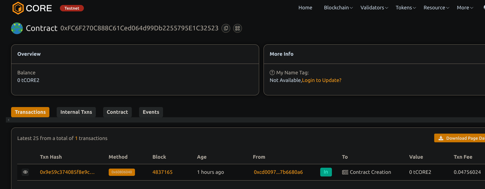

# Liquidity Pool with Automated Market Maker (AMM)

## 📖 Project Description

This smart contract implements a Uniswap-style liquidity pool using a constant product AMM. It allows users to add liquidity, remove liquidity, and swap between two ERC-20 tokens with an embedded 0.3% fee.

## 🌍 Project Vision

To enable decentralized and permissionless token swaps with incentivized liquidity provisioning through automated market-making logic.

## 🔑 Key Features

- Supports two ERC-20 tokens
- Constant product formula (`x * y = k`)
- 0.3% fee on swaps (997/1000)
- Liquidity providers receive LP shares
- Liquidity removal with proportional asset return

## 🚀 Future Scope

- Multi-token pools
- Time-weighted average price (TWAP)
- On-chain oracle integration
- LP token as ERC-20
- DAO-based fee governance

## Contract details
0xFC6F270C888C61Ced064d99Db2255795E1C32523